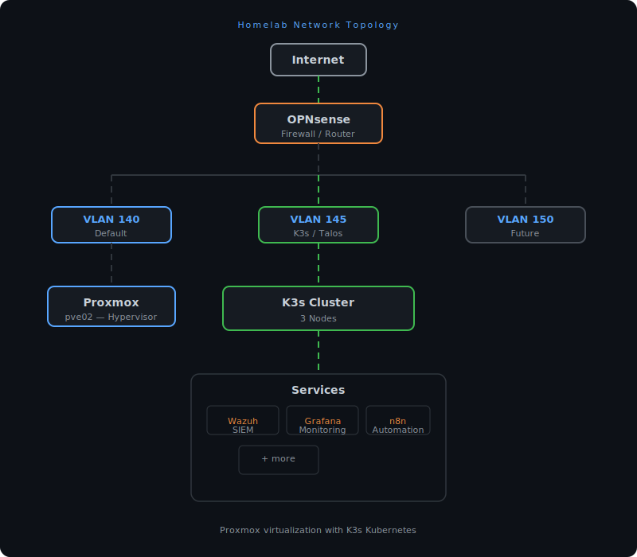

# Infrastructure Docs

**Homelab infrastructure documentation — Proxmox, K3s, networking, and services.**

> ⚠️ **This project is archived.** No longer under active development.

---

## What's Documented

Reference documentation for a homelab running Proxmox virtualization with K3s Kubernetes clusters.

### Topics Covered

- **Proxmox** — Hypervisor setup, VM management
- **Kubernetes** — K3s cluster architecture, node configuration
- **Networking** — VLAN topology, OPNsense firewall
- **Services** — Wazuh (SIEM), n8n (automation), Grafana (monitoring)

## Network Overview

---

No longer maintained.

