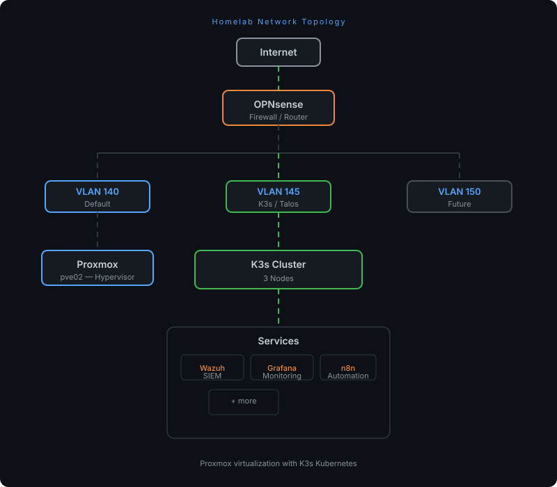

> [!NOTE]
> **Archived.** This repo is part of [Cortex](https://github.com/cortex-io), which is no longer under active development. It is kept as a working record: explore, fork and borrow freely, but no fixes or features are planned.

<a href="https://github.com/cortex-io"><b>Cortex</b></a> &nbsp;·&nbsp; <a href="https://github.com/cortex-io/cortex">cortex</a> · <a href="https://github.com/cortex-io/cortex-platform">cortex-platform</a> · <a href="https://github.com/cortex-io/cortex-gitops">cortex-gitops</a> · <a href="https://github.com/cortex-io/cortex-k3s">cortex-k3s</a> · <a href="https://github.com/cortex-io/cortex-docs">cortex-docs</a> · <a href="https://github.com/cortex-io/cortex-construction-hq">cortex-construction-hq</a> · <b>infrastructure-docs</b>

## What's documented

Reference documentation for the homelab Cortex ran on: Proxmox virtualization underneath K3s Kubernetes, segmented into VLANs behind an OPNsense firewall.

| Topic | What's covered |
|---|---|
| [Proxmox](proxmox/) | Hypervisor setup and VM management |
| [Kubernetes](kubernetes/k3s/) | K3s cluster architecture and node configuration |
| [Networking](network/) | VLAN topology and the OPNsense firewall |
| [Services](services/) | Wazuh (SIEM), n8n (automation), Grafana (monitoring) |

---

Part of the <a href="https://github.com/cortex-io">Cortex archive</a> · built with Claude

